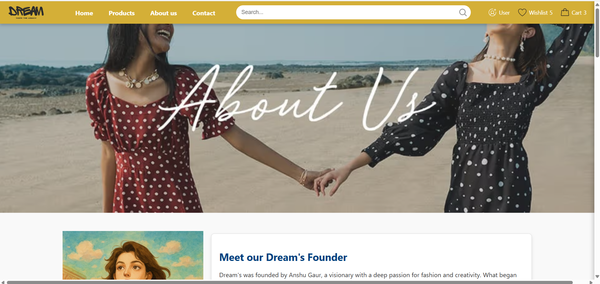

# Dream - Taste the Legacy


AGaur is a stylish fashion e-commerce website designed to offer high-quality clothing for all occasions. The website allows users to browse a wide selection of products, add them to their cart, and proceed with a seamless checkout experience. Additionally, it provides users with personalized experiences, including the ability to log in, create an account, search for products, and contact customer support.

## Features

- **Home Page**: Displays featured products, banners, and promotional offers.
- **Product Page**: Showcases various categories of clothing including formal wear, casual dresses, and seasonal collections.
- **Product Search**: Users can search for products by entering keywords like clothing type, size, or brand.
- **Product Filtering and Sorting**: Users can browse products based on categories, price range, and other criteria.
- **Cart and Checkout**: Users can add products to their cart and view the total price. Checkout functionality is integrated.
- **User Authentication**: Users can log in, register, and manage their accounts.
- **Contact Us**: Users can get in touch with customer support through the contact page.
- **Responsive Design**: The website is fully responsive, ensuring a seamless experience across devices.


## Website Screenshots

# 🌐 AGaur – Web View

Welcome to the AGaur Web Project! Below are the previews of various pages of this site.

---

## 🏠 Home Page


## 🔐 Login Page


## 🛒 Cart Page


## 📦 Item Page


## 📞 Contact Page


## 📄 About Pages



**🔗 Watch Demo Video:**  
[Click Here](web_view/web_view_video.mp4)

## Technologies Used

- **HTML5**: For structuring the website content.
- **CSS3**: For styling and responsive layout design.
- **JavaScript**: To handle user interactions like cart updates, search functionality, and form validation.
- **Font Awesome**: For icons like the shopping cart, wishlist, and social media links.
- **Local Storage**: For saving cart data and user information for a more personalized experience.

## Setup Instructions

### Prerequisites

- Ensure that you have a web server or a local development environment (like **XAMPP**, **WAMP**, or **Live Server** for Visual Studio Code).

### Clone the Repository

To get started with the project, clone the repository using the following command:

```bash
git clone https://github.com/anshu0816/anshu0816.git
